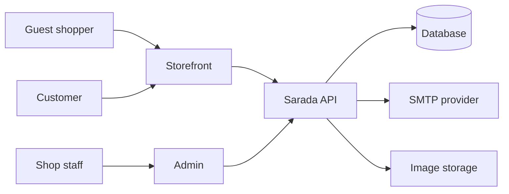
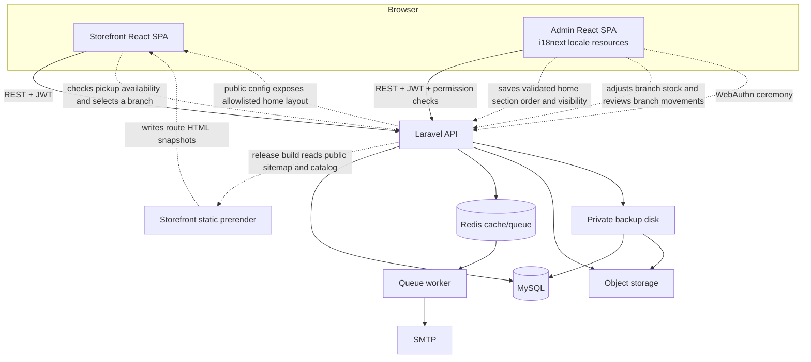
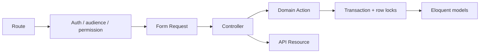

# C4 Diagrams

## Context

```mermaid
flowchart LR
  Guest[Guest shopper] --> Store[Storefront]
  Customer[Customer] --> Store
  Staff[Shop staff] --> Admin[Admin]
  Store --> API[Sarada API]
  Admin --> API
  API --> DB[(Database)]
  API --> Mail[SMTP provider]
  API --> Images[Image storage]
```

## Containers

```mermaid
flowchart TB
  subgraph Browser
    S[Storefront React SPA]
    A[Admin React SPA<br/>i18next locale resources]
  end
  S -->|REST + JWT| L[Laravel API]
  L -. release build reads public sitemap and catalog .-> P[Storefront static prerender]
  P -. writes route HTML snapshots .-> S
  A -->|REST + JWT + permission checks| L
  A -. saves validated home section order and visibility .-> L
  L -. public config exposes allowlisted home layout .-> S
  S -. checks pickup availability and selects a branch .-> L
  A -. adjusts branch stock and reviews branch movements .-> L
  A -. WebAuthn ceremony .-> L
  L --> M[(MySQL)]
  L --> R[(Redis cache/queue)]
  R --> W[Queue worker]
  W --> E[SMTP]
  L --> O[Object storage]
  L --> B[Private backup disk]
  B --> M
  B --> O
```

## Request component path

```mermaid
flowchart LR
  Route --> Middleware[Auth / audience / permission]
  Middleware --> Request[Form Request]
  Request --> Controller
  Controller --> Action[Domain Action]
  Action --> Transaction[Transaction + row locks]
  Transaction --> Model[Eloquent models]
  Controller --> Resource[API Resource]
```
